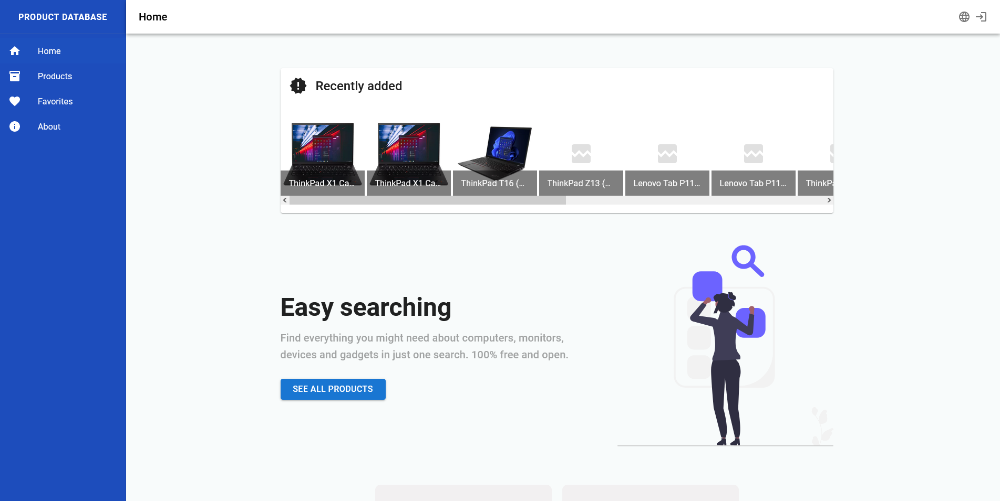
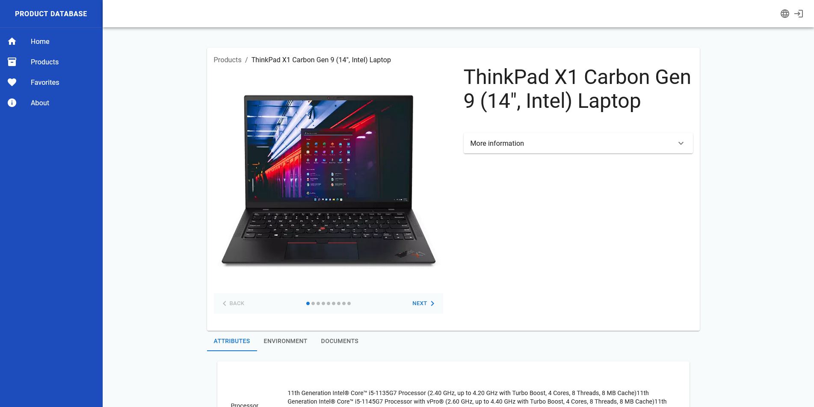
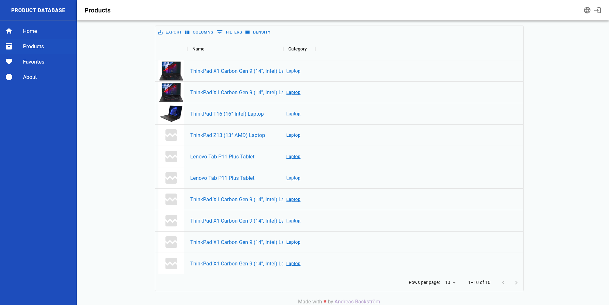

<!-- PROJECT LOGO -->
 

  

<h3 align="center">Product Database</h3>

  

    A open-source, api-driven product database containing all information you will ever need about all kinds of products.
     
    <a href="https://devicecorner.se"><strong>Go to website »</strong></a>
     
     
    <a href="https://github.com/Mozzo1000/product-database/wiki"><s>Explore the docs</s></a>
    <a href="https://github.com/Mozzo1000/product-database/issues">Report Bug</a>
    <a href="https://github.com/Mozzo1000/product-database/issues">Request Feature</a>
  

  

|           Home page            |          Product page          |          Product list          |
| :----------------------------: | :----------------------------: | :----------------------------: |
|  |  |  |

## Contributing
If you have a suggestion that would make this project better, please open a open an issue with the tag "enhancement". You are also more than welcome to help with new features or fix bugs in the code. Start by reading the [contributing](CONTRIBUTING.md) and [development](DEVELOPMENT.md) guides to get started.

## License
`product-database` is licensed under the Apache License, Version 2.0. See [LICENSE](LICENSE) for the full license text.